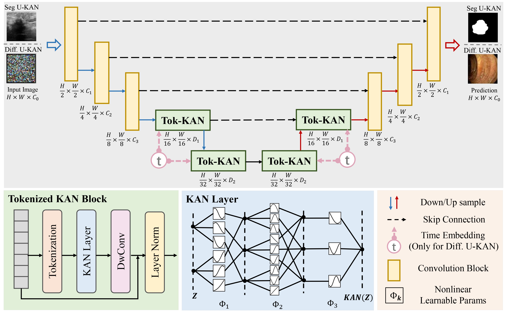

# What is KAN?

## Kolmogorov-Arnold Networks
##### New class of neural networks aimed to be more less prone to overfitting and more interpretable than multi-layer perceptrons

##### In this experiment we see if KAN can truly outperform MLP in segmentation tasks. I conduct the following experiments:
- Train U-KAN (using KAN) and U-Net (using MLP) architectures on Brats2023 Brain MRI segmentation dataset
- Evaluate U-KAN and U-Net dice similarity performance 
- Evaluate U-KAN and U-Nets sensitivity to sample size and number of epochs
- Evaluate U-KAN and U-Net computational load

